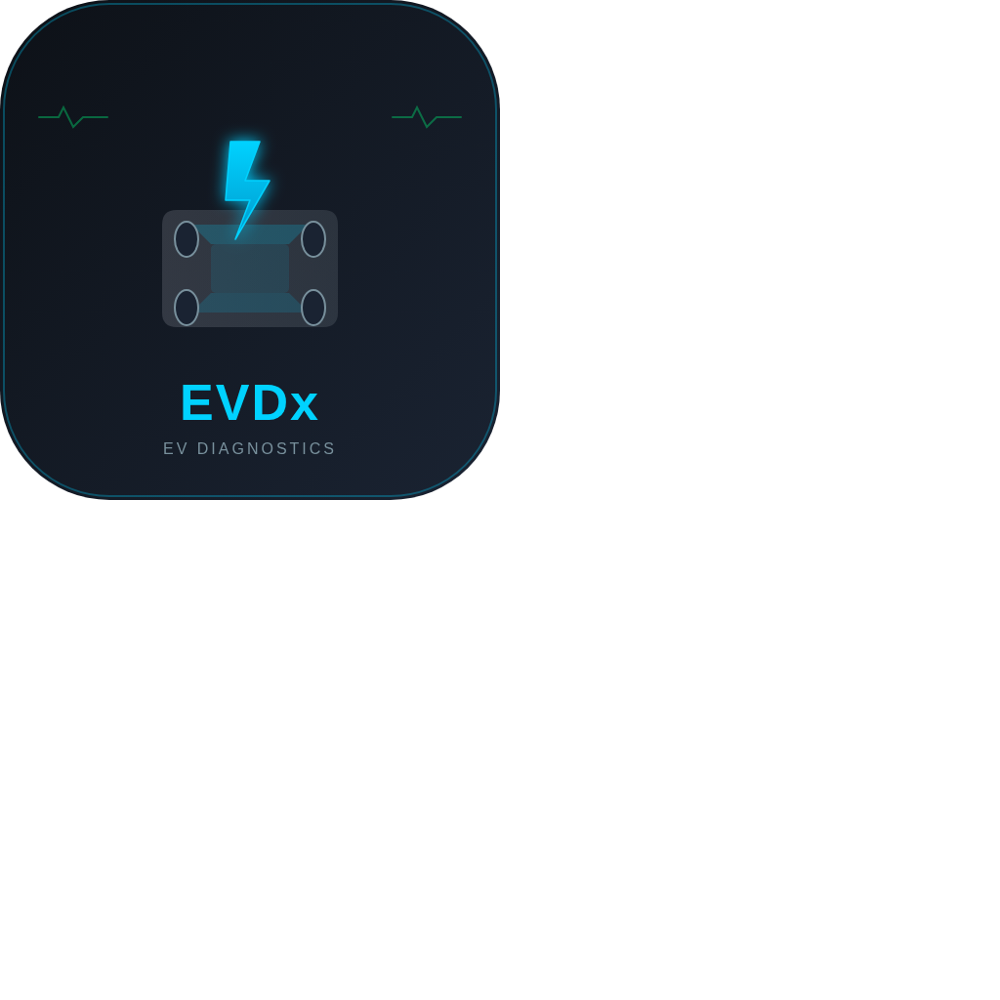

# EV Connect — BYD OBD-II Monitor

Real-time OBD-II diagnostics and monitoring for BYD electric vehicles. Connect via Bluetooth BLE, WiFi, or try the interactive demo.

<p align="center">
  
</p>

<p align="center">
  <strong>Dr. Waleed Mandour</strong> · <a href="mailto:waleedmandour@gmail.com">waleedmandour@gmail.com</a> · <a href="https://github.com/waleedmandour">waleedmandour.github.io</a>
</p>

<p align="center">
  <em>Created via GLM-5-Turbo</em>
</p>

---

## Features

### Dashboard
- Real-time speed semicircle gauge (0–180 km/h)
- Battery SOC arc gauge with color-coded thresholds
- Motor power draw / regen power gauge
- Estimated range, drive mode (ECO / NORMAL / SPORT)
- **Smart Alerts** — automatic notifications for critical conditions:
  - 🔋 Low/critical battery warnings
  - 🌡️ Motor and battery overheating alerts
  - ⚡ High power draw warnings
  - 📊 Low range alerts
  - ⚠️ Fault code (DTC) detection alerts
  - ♻️ Regen braking energy recovery info
- Live speed profile sparkline chart
- Power flow chart (draw vs. regen, with zero reference line)
- Temperature monitoring bars (motor, battery pack, cabin, ambient)

### Battery Monitor
- Large SOC display with animated progress bar
- Pack voltage (V), current (A), and power (kW)
- Live history charts for SOC, voltage, and temperature
- Battery health diagnostics (SOH, cell balancing, insulation resistance, cycle count, cell voltage delta)
- BYD Blade Battery specifications (60.48 kWh LFP, 120S1P, liquid cooled)

### Device Info (OBD-II Adapter)
- **Adapter identification:** model, firmware version, protocol description
- **Connection type indicator:** Bluetooth BLE or WiFi with live status
- **Signal strength** monitoring with visual bar
- **Response time** tracking with history chart
- **Vehicle Identification:** VIN, motor specs, battery specs
- **Firmware version check** with update status
- **WiFi setup guide** for ELM327 WiFi adapters
- **Compatibility notes** for BLE vs WiFi adapters

### Diagnostics
- MIL (Check Engine Light) status indicator
- Scan ECU for Diagnostic Trouble Codes
- Clear all DTCs
- 30+ EV-specific code definitions (P0A00–P1A0C, P0D00–P0D02, C0300, U0100–U0151)
- Emission monitor readiness status (8 monitored systems)

### Session Logger & Eco Driving
- **Eco Driving Score** (0–100) with animated circular gauge
- Score breakdown: acceleration, braking, speed, efficiency
- **Live score history** chart
- **Data Logger:** start/stop session recording at ~2 Hz
- **CSV Export:** download full session data for analysis
- Real-time stats grid (speed, power, SOC, regen, mode, temp)
- BYD-specific eco driving tips

### Vehicle Controls
- Detailed explanation of OBD-II protocol limitations
- 7 control items with availability status and reasons
- Alternative approaches (BYD official app, aftermarket, XDA community)

### Voice Guide (New)
- **Professional voice narration** for every app page
- Uses the Web Speech API (SpeechSynthesis) with natural/enhanced voices
- Toggle on/off via the speaker icon in the header
- Automatically reads page instructions and feedback when you navigate to any tab
- Each page has a comprehensive audio guide explaining all features, metrics, and how to use them
- Prefers Google/Microsoft/Apple natural voices when available

### Smart Alerts (New)
- Real-time monitoring of vehicle conditions
- Automatic alerts for: critical battery, low battery, motor overheating, battery overheating, high power draw, DTC detection, low range, and regen activity
- Color-coded severity: red (danger), amber (warning), cyan (info), green (success)
- Collapsible alert panel with unread count badge

### Connectivity
- **Bluetooth BLE** — Web Bluetooth API for ELM327 adapters (Chrome on Android)
- **WiFi** — Connect to OBD-II adapter's WiFi hotspot (works on Android + iOS)
- **Demo Mode** — Realistic driving simulator, no hardware needed

## Supported OBD-II Adapters

| Adapter | Type | Notes |
|---------|------|-------|
| ELM327 v1.5+ | BLE / WiFi | Most popular. Requires Nordic UART Service for BLE. |
| ELM327 v2.1 | BLE / WiFi | Genuine chip, more reliable CAN communication. |
| vLinker FS | BLE | Excellent build quality, fast response times. |
| Carista | BLE | Good build but limited custom PID support. |
| ScanTool | WiFi | Reliable WiFi, standard port 35000. |
| Konnwei | WiFi | Budget option, adequate for basic PIDs. |

> **WiFi Setup:** The phone connects to the adapter's WiFi network (SSID: ELM327, WiFi_OBDII, etc.), not the other way around. Port 35000 is standard for most WiFi adapters.

## Tech Stack

| Layer | Technology |
|-------|-----------|
| Framework | Next.js 16 (App Router) |
| Language | TypeScript 5 |
| Styling | Tailwind CSS 4 |
| UI Components | shadcn/ui + Lucide Icons |
| State | Zustand |
| Charts | Custom SVG sparklines |
| PWA | Web App Manifest + Service Worker |
| Bluetooth | Web Bluetooth API (BLE GATT) |
| WiFi | WebSocket / TCP bridge |
| Voice | Web Speech API (SpeechSynthesis) |

## Getting Started

### Prerequisites
- Node.js 18+ or Bun
- A compatible OBD-II adapter (see table above)
- For BLE: Chrome on Android
- For WiFi: Any modern browser (Android or iOS)

### Install & Run

```bash
# Clone
git clone https://github.com/waleedmandour/EVD.git
cd EVD

# Install dependencies
bun install

# Start dev server
bun run dev
```

Open [http://localhost:3000](http://localhost:3000) and tap **Launch Interactive Demo** to explore.

### WiFi Connection Steps

1. Plug the WiFi OBD-II adapter into the OBD-II port
2. On your phone, go to Settings → WiFi
3. Find and connect to the adapter's network (e.g., "ELM327", "WiFi_OBDII")
4. Return to EV Connect → tap **Connect WiFi Adapter**
5. Enter the adapter's IP (default: `192.168.0.10`) and port (default: `35000`)
6. Tap Connect

### Voice Guide

1. Tap the **speaker icon** in the top-right corner of the header
2. The icon turns green with a dot when enabled
3. Navigate to any tab — the app will automatically read a professional guide for that page
4. Tap the speaker icon again to mute

### PWA Install

1. Open the app URL in Chrome on Android
2. Tap the three-dot menu → **Install app**
3. The app installs to your home screen with its own icon

## Live Deployment

**[https://evd-ochre.vercel.app](https://evd-ochre.vercel.app)**

## Project Structure

```
src/
├── app/
│   ├── layout.tsx          # Root layout with PWA meta tags
│   └── page.tsx            # Main app with 6-tab routing + voice + footer
├── components/
│   └── byd/
│       ├── gauges.tsx          # SVG gauge + chart components
│       ├── DashboardView.tsx    # Speed, power, temps, charts, alerts
│       ├── BatteryView.tsx     # SOC, voltage, health diagnostics
│       ├── DeviceView.tsx      # Adapter info, signal, firmware check
│       ├── DiagnosticsView.tsx # DTC scan, monitor readiness
│       ├── SessionView.tsx     # Eco score, data logger, CSV export
│       ├── ControlsView.tsx    # OBD-II limitation explanation
│       ├── SmartAlerts.tsx     # Real-time vehicle condition alerts
│       ├── ConnectOverlay.tsx  # BLE / WiFi / Demo connection
│       └── Navigation.tsx      # 6-tab bottom nav + header + voice toggle
├── hooks/
│   └── use-voice.ts           # Web Speech API voice narration hook
├── lib/
│   ├── store.ts             # Zustand state management
│   ├── simulator.ts         # Realistic EV driving simulator
│   └── types.ts             # Types, OBD-II PIDs, DTC codes
public/
├── manifest.json           # PWA manifest
├── sw.js                   # Service worker (cache-first)
└── icons/
    ├── icon-192.png
    └── icon-512.png
```

## OBD-II Support

Standard SAE J1979 PIDs are defined for:

| PID | Parameter |
|-----|-----------|
| 04 | Calculated Engine Load |
| 05 | Engine Coolant Temperature |
| 0C | Engine/Motor RPM |
| 0D | Vehicle Speed |
| 0F | Intake Air Temperature |
| 11 | Throttle Position |
| 42 | Control Module Voltage |
| 46 | Ambient Air Temperature |
| 61 | Driver Demand Torque |
| 62 | Actual Engine Torque |

Plus additional EV-specific DTC codes for BYD powertrain systems.

## Supported Vehicles

Designed and tested for:
- **BYD Yuan Plus / Atto 3** (60.48 kWh Blade Battery)

The standard OBD-II layer works with any OBD-II compliant vehicle. BYD-specific features (battery specs, DTC definitions) are tuned for BYD EVs.

## License

MIT

---

**Built by Dr. Waleed Mandour · waleedmandour@gmail.com · Created via GLM-5-Turbo**
